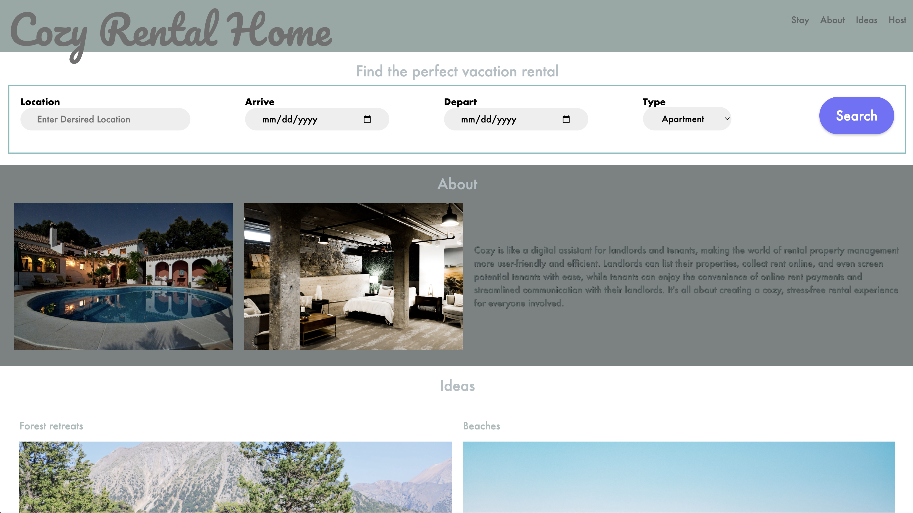
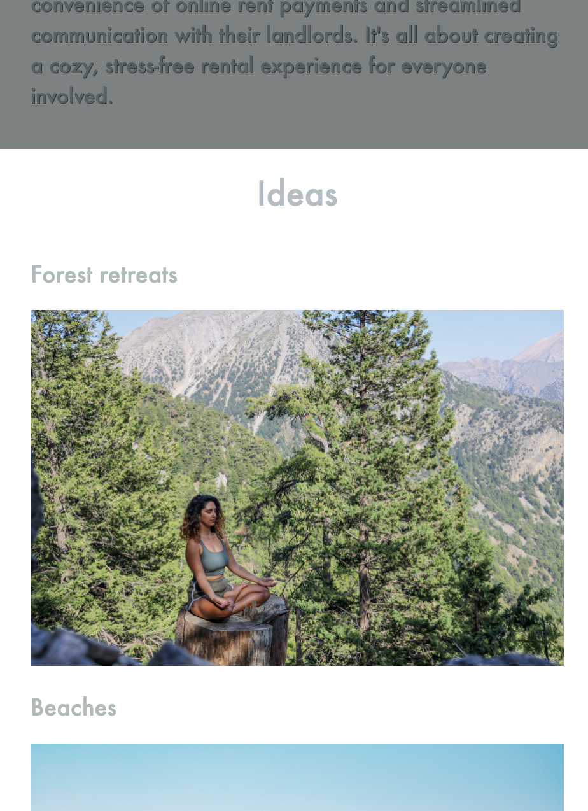
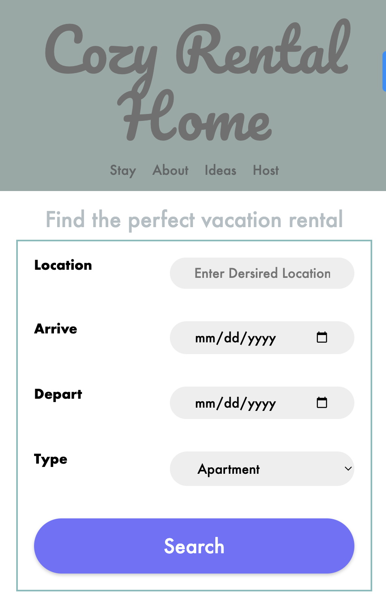
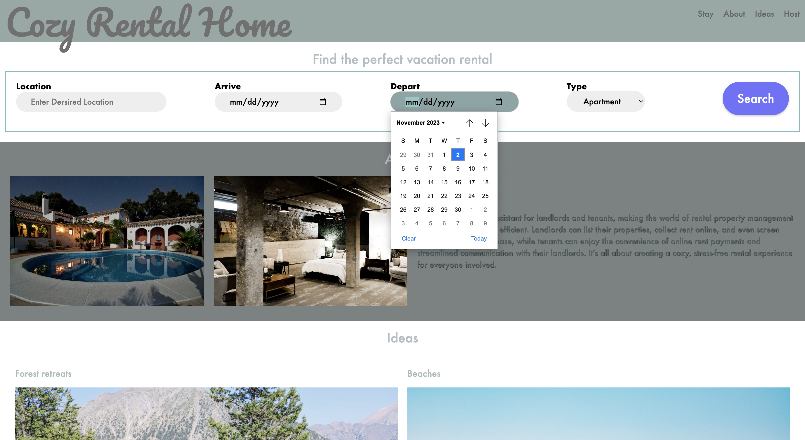
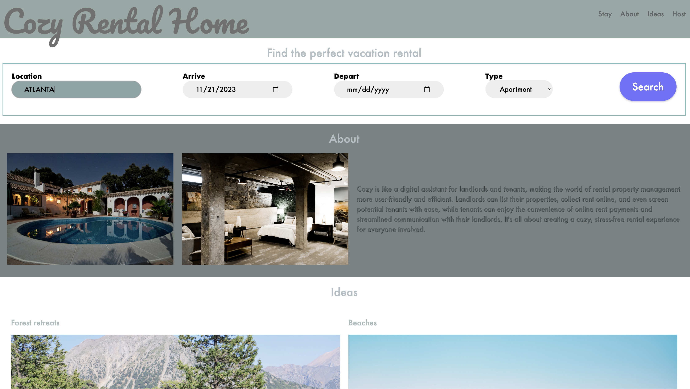

# COZY Rental home

live here: https://catherinealdana.github.io/cozyrentalhome/

COZY is a vacation rental website that allows people to rent out their homes to people who are seeking short-term accommodations in that locale. COZY hosts rent out different kinds of properties, including single rooms, apartments, and unique living spaces such as yachts, houseboats, yurts, tiny houses, and even renovated medieval castles.

COZY's landing page is using HTML & CSS.

### Existing files

| File         | Description                                                             |
| ------------ | ----------------------------------------------------------------------- |
| `images/`    | A folder containing all the images used for the design.                 |
| `index.html` | The starter HTML file. You will need to add your solution to this file. |
| `style.css`  | The starter css file. You will need to add your solution to this file.  |

### Setup

Use VSCode Live Server to launch the `index.html` page in your browser.

#### Navigation

- The logo should stack on top of the menu links, which are aligned horizontally, as follows:

- **Single-page navigation**: Modify the navigation links so that clicking on each link will take the user to the corresponding sections on the page, as follows:

#### HTML form

- In the "Find your perfect vacation rental" section, a form that contains the following input fields with the specified types:

  - `Location`: `text` input type, with a placeholder value of "Search destination"
  - `Arrive`: `date` input type
  - `Depart`: `date` input type
  - `Type`: a dropdown list with the following options:
    - Apartment
    - Barn
    - Castle
    - Houseboat
    - Tiny House
    - Yacht
    - Yurt
  - a `"Search"` button

- Some CSS styles have already been written for you to help style your form. Add CSS to the form so that
  - the labels (i.e., "Location", "Arrive", "Depart", "Type") and their corresponding form fields are aligned towards the opposite ends of each row

#### Vertical content alignment

- The content in the remainder of the sections (i.e., "About", "Ideas", "Want to become a COZY Host?"), including any text and images, should stack on top of each other. Refer to the mobile design shared above.

#### Responsive images

- There is CSS for all images so that the images will match whatever container width they are placed within, and changing the container sizes will update the image sizes appropriately.

#### Media query: Desktop view

Now that your mobile design is looking good, you will need to adapt the design for the desktop view.

- In `style.css`, create a media query for screens that are wider than `480px`.

 CSS to create the following designs for desktop:

- The logo and the navigation menu links is spaced apart from each other, like this:

- The search form input fields and the button should be horizontally aligned, like this:

- The items in the "About" section should be horizontally aligned. The paragraph content should be vertically centered and always be about twice as wide as each image item, like this:

- The "Ideas" images should be displayed in a 2 by 2 grid (see the desktop design shared above).

- The items in the "Want to Become a COZY Host?" section should be horizontally aligned. The paragraph content should be vertically centered and be as wide as each image item, like this:

